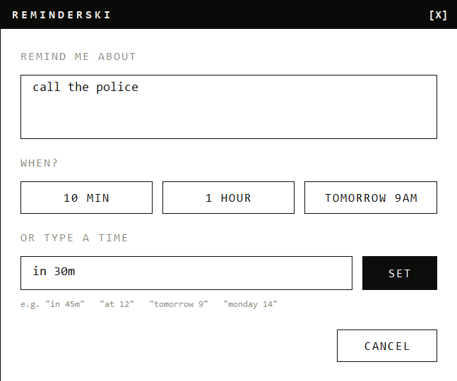
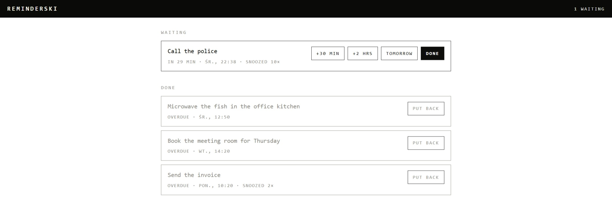

# Reminderski

[](https://github.com/goorskyy/reminderski/actions/workflows/ci.yml)

A tiny, fast, local reminder app for Windows, inspired by Slack's reminder workflow.

Select text → **Ctrl+Alt+R** → type `in 40m` → Enter → forget about it.



Whatever you had selected is already in the box, so a reminder is usually one shortcut and a time
expression. Nothing about it is themed: the window is drawn by hand, monochrome, and answers to
the keyboard first.

When it comes due, a notification appears in the corner with Done and three snoozes.


It does not steal the focus when it appears, so it never swallows what you are typing. Press
Ctrl+Alt+A to reach it, and then Enter for Done, 1, 2 or 3 for the snoozes, or Escape to leave it
for later.

Nothing leaves the machine. There is no account and nothing to sign in to: one self-contained
executable, and your reminders in one text file.

## Installing

Download `reminderski-x86_64-pc-windows-msvc.exe` from the
[latest release](https://github.com/goorskyy/reminderski/releases/latest) and run it. There is
nothing to install and nothing else to download: the executable is self-contained.

On an ARM64 machine take `reminderski-aarch64-pc-windows-msvc.exe` instead. The x64 one also
runs there, emulated.

Running it puts an `R` in the notification area and nothing else on screen. Leave it there and
press Ctrl+Alt+R whenever you want to set a reminder. To stop it, right-click the icon and
choose Quit.

To have it there after a restart, right-click the icon and tick *Start with Windows*. That adds
one entry to your own startup list, the same one Task Manager shows under Startup, so it can be
turned off from either place. It is off until you ask for it.

## Time expressions

Relative: `in 40m`, `40m`, `1h30m`, `2 days 3 hours`. The leading `in` is optional.

Absolute: `at 15:00`, `at 3pm`, `at 3:30 pm`, `at 9`, `today at 18:00`, `tomorrow`,
`tomorrow at 9:30`. A clock time that has already passed means tomorrow, and a bare `tomorrow`
means 09:00.

By day name: `friday`, `fri`, `monday 14`, `friday at 3pm`, `next tuesday`. A day name means the
next one to come round, which is today only when the time has not yet passed, and a bare one
means 09:00. Writing `next` in front rules today out and changes nothing else, so on a Wednesday
`next friday` is the same Friday as `friday`.

## Dashboard

Double-click the tray icon, or right-click it and choose *Open dashboard*, for a page listing
what is waiting and what is finished, with Done and snooze on each.



It is at <http://127.0.0.1:7654> while Reminderski is running, and on another port if something
else already has that one.

The page is built into the executable and served from the loopback address, so it works with no
network and nothing outside this machine can reach it.

## Data

Reminders are stored in `%APPDATA%\Reminderski\reminders.txt`, one per line.

Anything that goes wrong is written to `%APPDATA%\Reminderski\reminderski.log`. No file means
nothing has gone wrong.

## Building

Requires a Rust MSVC toolchain and Visual Studio Build Tools with the *Desktop development
with C++* workload, which provides the linker.

The workload's default components cover x64 and x86 only. On an ARM64 machine also add
`Microsoft.VisualStudio.Component.VC.Tools.ARM64`, or `cargo build` fails with
`linker link.exe not found`.

```
cargo build
cargo test
cargo fmt --check
cargo clippy --all-targets
```

A debug build has one extra key. Click a notification, then press **M** to step the character
through every mood in turn and then back to following the reminder's own history. The title bar
names the mood being held. Reaching the worst of them for real takes six snoozes, which is no way
to look at a drawing. The key is compiled out of a release build.

## Releases

Releases are cut by tagging: pushing a tag such as `0.0.1` builds that commit and attaches the
executables to a GitHub release of the same name.

The notes on that release are the commits since the previous tag: the subject as a heading and
the opening paragraph underneath, so nothing has to be written twice. Commits that only touch
documentation are left out, and the compare link at the bottom carries the full story for anyone
who wants it. The release arrives as a **draft**: read it, change anything that reads badly, and
press Publish.

To see what a tag will say before pushing it:

```
bash .github/release-notes.sh v0.0.2
```

## Project status

Early development, and honest about it.

Known problems are listed in [`FINDINGS.md`](FINDINGS.md), in the order they were noticed rather
than the order they will be fixed.

What might come next is in [`FEATURES.md`](FEATURES.md), in priority order. Nothing there is
promised.

The rules the code is held to, and the reasons for them, are in [`AGENTS.md`](AGENTS.md). Small,
readable, tested, and no abstraction that does not earn its place.

## Licence

MIT. See [`LICENSE`](LICENSE).
