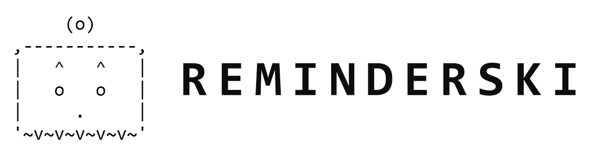
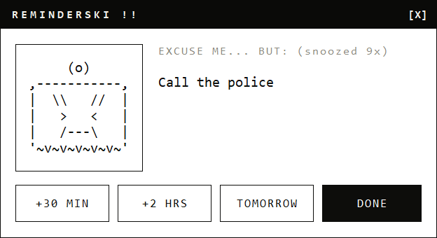

  <picture>
    <source media="(prefers-color-scheme: dark)" srcset="docs/logo-dark.png">
    
  </picture>

  Local reminders for Windows. 
  Select text, press <kbd>Ctrl</kbd>+<kbd>Alt</kbd>+<kbd>R</kbd>, say when.

  
  

  

It waits in the notification area and costs nothing until it has something to say. A reminder that
falls due never steals the focus, so it cannot swallow what you are typing: <kbd>Ctrl</kbd>+<kbd>Alt</kbd>+<kbd>A</kbd>
to reach it, then <kbd>Enter</kbd> for done, <kbd>1</kbd> <kbd>2</kbd> <kbd>3</kbd> to put it off.

Nothing leaves the machine.

## Install

Download the `.exe` from the [latest release](https://github.com/goorskyy/reminderski/releases/latest)
and run it. Nothing to install. The note appears in the notification area; right-click it to
quit, open the dashboard, or start it with Windows.

## When

`in 40m` · `1h30m` · `at 3pm` · `today at 18:00` · `tomorrow` · `friday at 9` · `next tuesday`

[All of it](docs/time-expressions.md).

## Etc

Reminders live in `%APPDATA%\Reminderski\reminders.txt`, one per line. The shortcuts are in
`settings.txt` beside it, or on the tray menu under Settings.

[Known problems](FINDINGS.md) · [Ideas](FEATURES.md) · [Building](docs/building.md) ·
[House rules](AGENTS.md) · [MIT](LICENSE)
